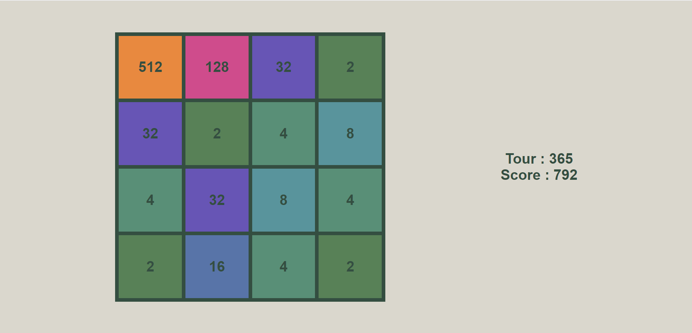

Le but de ce projet était de faire une IA pour résoudre un 2048. Je me suis rapidement rendu compte que le projet était trop complexe pour découvrir le machine learning. J'ai donc juste fait un simple algorithme pour essayer de le résoudre. Mais là encore, le 2048 a été un trop gros obstacle ... Voici mon record :

